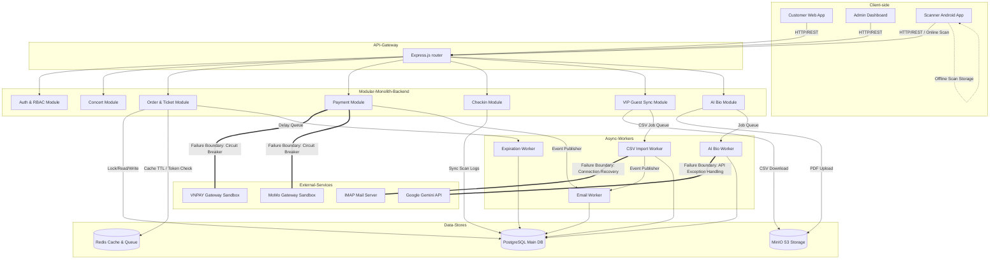
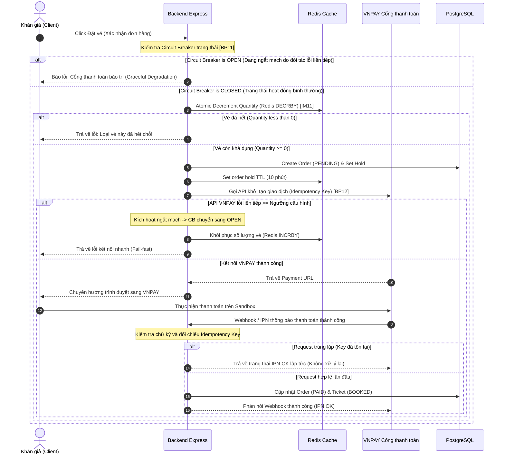
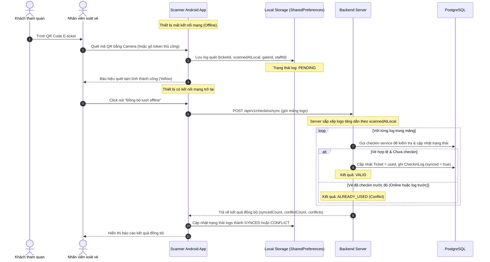
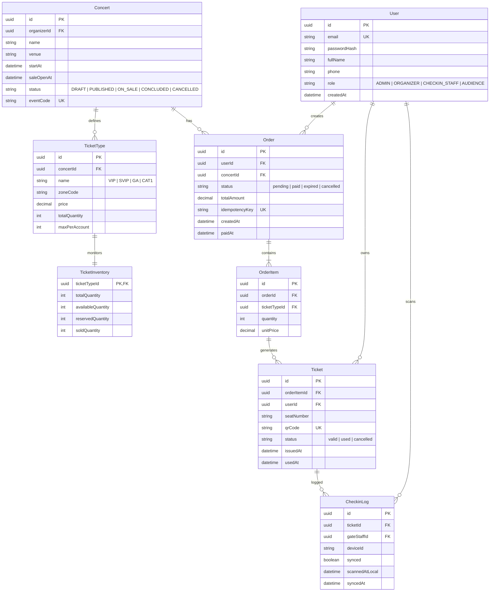

## KIẾN TRÚC TỔNG THỂ & KHẢ NĂNG CÔ LẬP LỖI - TICKETBOX

Tài liệu này trình bày thiết kế kiến trúc phần mềm của hệ thống **TicketBox**, lý do lựa chọn mô hình kiến trúc, cách các thành phần tương tác và cơ chế cô lập lỗi để bảo vệ hệ thống trước các sự cố vận hành thực tế.

---

### 1. Kiến trúc Tổng thể (Overall Architecture)

Hệ thống TicketBox được thiết kế theo mô hình **Modular Monolith (Monolith đơn khối phân rã mô-đun)** đối với Backend, kết hợp với các Frontend được tách biệt hoàn toàn theo vai trò người dùng (Customer Web, Admin Portal, Scanner App).

```
                     +---------------------------------------+
                     |         Khán giả (Audience)           |
                     |  Customer Web App (Next.js 14 client) |
                     +-------------------+-------------------+
                                         | HTTP (JWT)
                                         v
                     +-------------------+-------------------+
                     |           API Gateway / Router        |
                     +-------------------+-------------------+
                                         |
         +-------------------------------+-------------------------------+
         |                               |                               |
         v (Module)                      v (Module)                      v (Module)
+------------------+            +------------------+            +------------------+
|  auth & rbac     |            |  concert         |            |  order & ticket  |
+------------------+            +------------------+            +------------------+
|  payment         |            |  checkin         |            |  vip-guest-sync  |
+------------------+            +------------------+            +------------------+
|  ai (Artist Bio) |            |  notification    |            |  admin           |
+------------------+            +------------------+            +------------------+
         |                               |                               |
         +-------------------------------+-------------------------------+
                                         |
                                         v
            +----------------------------+----------------------------+
            |                                                         |
            v                                                         v
   +--------+--------+                                       +--------+--------+
   |   PostgreSQL    |                                       |      Redis      |
   | (Transactional) |                                       | (Cache / Queue) |
   +-----------------+                                       +-----------------+
            ^                                                         ^
            |                                                         |
            +----------------------------+----------------------------+
                                         |
                                         v
                           +-------------+-------------+
                           |    Background Workers     |
                           |  (Expiration, AI, CSV...) |
                           +---------------------------+
```

#### Các thành phần chính trong hệ thống:
1.  **Client-side (Ứng dụng phía máy khách):**
    *   **Customer Frontend (Next.js 14 App Router):** Phục vụ khán giả tìm kiếm concert, xem chi tiết và tiến hành luồng đặt vé, thanh toán trực tuyến.
    *   **Admin Frontend (Next.js):** Dành cho Ban tổ chức quản lý cấu hình vé, xem báo cáo doanh thu, duyệt tiểu sử nghệ sĩ do AI sinh và cấu hình nhãn hàng tài trợ.
    *   **Scanner Mobile App (Android Native Kotlin):** Ứng dụng di động chuyên dụng cho nhân viên soát vé tại các cổng kiểm soát, hỗ trợ quét camera QR ngoại tuyến và đồng bộ.
2.  **Backend Services (Express.js):** 
    Cấu trúc mã nguồn theo hướng **Modular Monolith** phân tách rõ ràng thành các mô-đun độc lập trong thư mục [backend/src/modules](file:///n:/DESIGN%20SYSTEM/DOAN/Ticket-Box-/backend/src/modules):
    *   `auth`: Quản lý tài khoản, JWT, cấp phát/thu hồi Refresh Token.
    *   `rbac`: Quản lý phân quyền Role-based Access Control.
    *   `concert`: Quản lý thông tin concert, sơ đồ khu vực SVG, cache concert tĩnh.
    *   `ticket` & `order`: Quản lý luồng đặt vé, khóa giữ chỗ tạm thời (Redis), kiểm tra per-user limit, chống bán lố vé.
    *   `payment`: Tích hợp sandbox MoMo/VNPAY, áp dụng Circuit Breaker cô lập lỗi và kiểm tra Idempotency chống trừ tiền trùng.
    *   `checkin`: Soát vé online/offline, đồng bộ dữ liệu checkin log, xuất dữ liệu checkin realtime.
    *   `vip-guest-sync`: Đồng bộ khách mời tài trợ thông qua quét mailbox IMAP và parse file CSV tự động.
    *   `ai`: Upload PDF, trích xuất text và gửi Gemini API để tạo Artist Bio.
3.  **Data Storage & Messaging (Lưu trữ dữ liệu & Truyền tin):**
    *   **PostgreSQL (ORM Prisma):** Lưu trữ dữ liệu có tính toàn vẹn cao (giao dịch thanh toán, thông tin vé, cấu hình concert, tài khoản người dùng).
    *   **Redis:** Đóng vai trò là bộ nhớ đệm (Cache danh sách concert), cơ chế khóa giữ vé tạm thời (TTL 10 phút), Rate Limiting counter, và lưu trữ thông tin phòng chờ (Sorted Set).
    *   **RabbitMQ:** Message Broker xử lý bất đồng bộ các sự kiện giữa các module (như thông báo `PaymentCompleted` để sinh vé và kích hoạt queue gửi email).
    *   **MinIO (S3-compatible):** Lưu trữ file PDF hồ sơ gốc nghệ sĩ, file ảnh QR E-Ticket và file CSV danh sách khách VIP gốc.

---

### 2. Lý do chọn Kiến trúc Modular Monolith

Mô hình **Modular Monolith** được lựa chọn thay vì Microservices dựa trên các lập luận kiến trúc và bối cảnh vận hành sau:

1.  **Duy trì tính nhất quán dữ liệu (Data Consistency):**
    Nghiệp vụ đặt vé concert đòi hỏi tính nhất quán giao dịch cực kỳ cao khi kiểm tra số lượng vé khả dụng còn lại để tránh bán lố (Overselling). Với Modular Monolith, hệ thống có thể thực hiện giao dịch ACID trực tiếp trên database PostgreSQL bằng cách khóa bi quan (`SELECT ... FOR UPDATE` trong transaction) trên các bảng `TicketInventory` và `TicketType`. Nếu chuyển sang Microservices, việc đảm bảo tính nhất quán trên hai DB khác nhau (Order DB và Inventory DB) yêu cầu các cơ chế giao dịch phân tán phức tạp (Saga Pattern, 2-Phase Commit) làm tăng đáng kể độ trễ (latency) và khả năng thất bại của giao dịch dưới tải cao.
2.  **Đơn giản hóa việc triển khai và vận hành (Deployment & Operations):**
    Đối với các đội ngũ phát triển quy mô vừa và nhỏ, việc vận hành hàng chục microservices đòi hỏi hạ tầng Kubernetes, CI/CD phức tạp và chi phí giám sát cao. Modular Monolith cho phép đóng gói toàn bộ backend thành một Docker container duy nhất, triển khai dễ dàng nhưng vẫn duy trì cấu trúc mã nguồn tách biệt, dễ bảo trì.
3.  **Giảm thiểu độ trễ mạng (Network Latency):**
    Trong luồng đặt vé cao tải, việc giao tiếp nội bộ giữa các dịch vụ thông qua gọi hàm (In-memory calls) có tốc độ nhanh hơn rất nhiều so với việc gọi API HTTP/gRPC qua mạng giữa các microservices độc lập, giúp tối ưu hóa thời gian giữ vé tạm thời và giảm tỷ lệ timeout của client.
4.  **Khả năng nâng cấp linh hoạt (Future Microservice Extraction):**
    Bằng việc tuân thủ quy tắc nghiêm ngặt: **Mô-đun này không được import trực tiếp vào file nội bộ của mô-đun khác** mà phải giao tiếp qua Interface, Event (RabbitMQ) hoặc Shared Library, hệ thống có thể dễ dàng tách bất kỳ mô-đun nào (ví dụ dịch vụ Thanh toán hoặc soát vé) thành một microservice độc lập khi quy mô hệ thống tăng lên mà không cần viết lại toàn bộ mã nguồn.

---

### 3. Khả năng Cô lập Lỗi (Error Isolation & Resilience)

Kiến trúc TicketBox được thiết kế với tư duy **Design for Failure (Thiết kế chịu lỗi)**, đảm bảo sự cố tại một thành phần không làm sập toàn bộ hệ thống (Cascading Failure).

```
+---------------------------------------------------------------------------------+
|                                 RANH GIỚI CHỊU LỖI                              |
|                                                                                 |
|  [Dịch vụ AI Bio Lỗi / Gemini API Down]                                          |
|         |-- Không ảnh hưởng --> [Khán giả tìm kiếm và mua vé vẫn hoạt động]       |
|                                                                                 |
|  [Cổng Thanh toán MoMo / VNPAY Lỗi liên tiếp]                                   |
|         |-- Kích hoạt Circuit Breaker --> [Báo cổng bảo trì - Các luồng khác OK] |
|                                                                                 |
|  [Database PostgreSQL quá tải]                                                  |
|         |-- Phục vụ từ Cache --> [Trang chủ / Danh sách Concert vẫn đọc được]     |
|                                                                                 |
|  [Hàng đợi Email/Thông báo bị nghẽn]                                            |
|         |-- Tách biệt Queue/Worker --> [Không ảnh hưởng luồng soát vé tại cổng]  |
+---------------------------------------------------------------------------------+
```

### Các cơ chế cô lập lỗi cụ thể:

1.  **Cô lập tích hợp cổng thanh toán (Circuit Breaker):**
    *   *Sự cố:* API của đối tác MoMo hoặc VNPAY bị chậm hoặc mất kết nối hoàn toàn.
    *   *Giải pháp:* Dịch vụ thanh toán sử dụng cơ chế Circuit Breaker. Khi phát hiện số lần kết nối thất bại vượt quá ngưỡng thiết lập (5 lần liên tiếp), mạch chuyển sang trạng thái **OPEN**.
    *   *Hiệu quả cô lập:* Toàn bộ yêu cầu thanh toán qua cổng lỗi sẽ bị từ chối nhanh (fail-fast), hệ thống trả về lỗi "Cổng thanh toán đang bảo trì" để người dùng chọn phương thức thanh toán khác hoặc thử lại sau. Điều này ngăn chặn việc các kết nối chờ (pending connection) làm cạn kiệt tài nguyên máy chủ (thread pool/memory socket), giữ cho luồng xem concert và đăng nhập hoạt động bình thường.
2.  **Cô lập xử lý AI (Gemini API & Worker):**
    *   *Sự cố:* Gemini API của Google bị chặn giới hạn (Rate Limit) hoặc file PDF bị lỗi không thể parse văn bản.
    *   *Giải pháp:* Toàn bộ quy trình sinh bio nghệ sĩ được thực hiện bất đồng bộ thông qua [ai-bio.worker.ts](file:///n:/DESIGN%20SYSTEM/DOAN/Ticket-Box-/backend/src/workers/ai-bio.worker.ts) tách biệt khỏi luồng HTTP xử lý request của Client.
    *   *Hiệu quả cô lập:* Khi tiến trình worker lỗi, nó chỉ cập nhật trạng thái bản ghi bio sang `FAILED` kèm thông tin lỗi mà không gây ảnh hưởng đến luồng đặt vé hay soát vé của người dùng. Ban tổ chức vẫn có thể upload lại hoặc biên tập bio nghệ sĩ thủ công.
3.  **Cô lập Cơ sở dữ liệu bằng Redis Caching:**
    *   *Sự cố:* Database PostgreSQL bị tải cao do hàng nghìn request đổ vào trang danh sách concert cùng lúc.
    *   *Giải pháp:* Hệ thống sử dụng chiến lược **Cache-aside** trên Redis cho các API công khai của danh sách concert.
    *   *Hiệu quả cô lập:* Đa số request đọc sẽ hit vào cache Redis. Ngay cả khi PostgreSQL gặp sự cố tạm thời hoặc phản hồi chậm, khách hàng vẫn có thể truy cập trang chủ và xem danh sách concert mượt mà từ Redis cache.
4.  **Cô lập dịch vụ gửi thông báo:**
    *   *Sự cố:* Hàng đợi gửi email vé điện tử bị nghẽn (ví dụ: máy chủ SMTP từ chối kết nối).
    *   *Giải pháp:* Tác vụ gửi email được tách thành queue riêng xử lý qua background worker.
    *   *Hiệu quả cô lập:* Việc email gửi chậm không ảnh hưởng đến giao dịch thanh toán thành công hay trạng thái vé trên DB. Khán giả vẫn sở hữu vé hợp lệ và có thể quét QR trực tiếp từ giao diện "Vé của tôi" trên Web App, trong khi worker email tự động thực hiện cơ chế retry để gửi mail sau.

---
## C4 Diagram

### Level 1 — System Context
<!-- Sơ đồ: TicketBox + actors + hệ thống ngoài (VNPAY, MoMo, AI model, CSV nhãn hàng) -->

### Level 2 — Container
<!-- Sơ đồ: web app, mobile app soát vé, backend API, database, message broker, ... -->

---
## High-Level Architecture Diagram (Tích hợp & Ngoại tuyến)

Phần này trình bày sơ đồ luồng dữ liệu (Data Flow) tổng quan của hệ thống và các trình tự xử lý (Sequence Diagrams) cho hai luồng nghiệp vụ đặc thù: tích hợp thanh toán (có ranh giới chịu lỗi) và soát vé ngoại tuyến.

### A. Sơ đồ luồng dữ liệu tổng quát (Data Flow Diagram)

Sơ đồ mô tả các điểm tương tác của Client, Module Backend, các hệ thống bên ngoài (VNPAY/MoMo, Gemini API, Mailbox) và các tầng lưu trữ, xử lý nền:



---

### B. Trình tự thanh toán & Ranh giới chịu lỗi (Payment Sequence with Failure Boundary)

Khi gọi API thanh toán của đối tác MoMo hoặc VNPAY, hệ thống bọc hàm gọi qua một Circuit Breaker để cô lập lỗi nhanh nếu đối tác gặp sự cố sập hoặc nghẽn mạng:



---

### C. Trình tự soát vé ngoại tuyến & Đồng bộ (Offline Scanner Sequence)

Sơ đồ mô tả quy trình soát vé tại sân vận động khi không có sóng mạng, lưu log tạm tại bộ nhớ SQLite/SharedPreferences của Android App và thực hiện đồng bộ gom lô (Batch Sync) khi có mạng trở lại:



---

## Thiết kế Cơ sở dữ liệu 

Hệ thống sử dụng chiến lược **Polyglot Persistence (Lưu trữ đa chủng loại)** để kết hợp thế mạnh của cơ sở dữ liệu quan hệ (SQL) và cơ sở dữ liệu lưu trữ trên RAM (NoSQL), đảm bảo tính toàn vẹn tài chính và hiệu năng phản hồi dưới tải cao.

### A. Lựa chọn loại Database và Lý do

1.  **Cơ sở dữ liệu chính: PostgreSQL (SQL Relational DB)**
    *   *Các phân hệ áp dụng:* Quản lý người dùng, concert, cấu hình giá vé, đơn hàng, thanh toán, e-ticket và logs check-in.
    *   *Lý do lựa chọn:* 
        *   **Tính tuân thủ ACID chặt chẽ:** Đơn hàng và thanh toán là dữ liệu tài chính, đòi hỏi tính toàn vẹn tuyệt đối. PostgreSQL hỗ trợ các giao dịch (Transactions) mạnh mẽ và khóa dữ liệu (Row-level Locking) để loại bỏ hoàn toàn các lỗi như ghi đè hoặc thất thoát dữ liệu.
        *   **Mối quan hệ chặt chẽ:** Dữ liệu có cấu trúc quan hệ cao (ví dụ: một Đơn hàng chứa nhiều Vé hạng VIP thuộc một Concert được tổ chức bởi một Organizer). Truy vấn SQL giúp thực hiện các phép kết hợp (JOIN) hiệu quả và thiết lập khóa ngoại (Foreign Keys) để duy trì tính nhất quán dữ liệu ở tầng lưu trữ.
2.  **Cơ sở dữ liệu đệm & Khóa: Redis (NoSQL Key-Value/In-Memory)**
    *   *Các phân hệ áp dụng:* Rate Limiting counter, Hàng đợi phòng chờ (Waiting Room), Khóa giữ vé tạm thời (Ticket Hold), Cache danh sách concert tĩnh.
    *   *Lý do lựa chọn:*
        *   **Tốc độ đáp ứng cực cao:** Dữ liệu giữ vé tạm thời thay đổi liên tục và có thời gian sống ngắn (TTL 10 phút). Ghi trực tiếp các thao tác này vào PostgreSQL dưới tải 80.000 user/5 phút sẽ làm sập DB. Redis lưu trữ hoàn toàn trên RAM giúp xử lý hàng chục nghìn thao tác đọc/ghi trong 1 giây với độ trễ < 1ms.
        *   **Tính nguyên tử (Atomicity):** Hỗ trợ các lệnh nguyên tử như `DECRBY` / `INCRBY` để trừ tồn kho vé tức thời và an toàn mà không cần khóa bảng dữ liệu vật lý.
3.  **Lưu trữ đối tượng: MinIO / AWS S3 (Object Storage)**
    *   *Các phân hệ áp dụng:* File SVG sơ đồ ghế ngồi, file PDF hồ sơ nghệ sĩ, file CSV danh sách khách VIP nhãn hàng tài trợ.
    *   *Lý do lựa chọn:* Giảm tải lưu trữ file nhị phân lớn cho PostgreSQL, giúp cơ sở dữ liệu gọn nhẹ và tối ưu hóa việc sao lưu (Backup) cũng như khôi phục (Restore).

---

### B. Thiết kế Schema cho các Entity quan trọng

Dưới đây là thiết kế chi tiết thực thể (Schema) của các bảng chính trong hệ thống (ánh xạ trực tiếp từ sơ đồ cơ sở dữ liệu quan hệ):



#### Mô tả chi tiết mối quan hệ và Ràng buộc nhất quán (Consistency Constraints):
*   **TicketInventory (Tồn kho vé):** Sử dụng quan hệ 1-1 với `TicketType`. Trường `availableQuantity` đại diện cho số lượng vé thực sự còn trống để bán và được liên tục đồng bộ giảm khi có lệnh `DECRBY` trên Redis trong luồng giữ vé.
*   **Idempotency Key:** Cấu hình unique (`UK`) trên trường `idempotencyKey` của bảng `Order` và bảng `Payment` để đảm bảo cơ chế không ghi trùng dữ liệu ở mức Database vật lý (ngăn chặn double inserts do lỗi mạng).
*   **Mối liên kết soát vé (CheckinLog):** Bảng `CheckinLog` liên kết trực tiếp tới `Ticket` (quan hệ 1-n) để lưu lại dấu vết lịch sử quét vé của nhân sự soát vé (`gateStaffId`), hỗ trợ đối soát chéo và xử lý xung đột ngoại tuyến.

---
## Thiết kế kiểm soát truy cập
<!-- Mô hình phân quyền, các nhóm người dùng, cách kiểm tra quyền tại từng điểm truy cập -->
---
## Thiết kế các cơ chế bảo vệ hệ thống

### Xử lý cổng thanh toán không ổn định
Để bảo vệ hệ thống trước sự cố nghẽn mạng hoặc sập dịch vụ từ cổng thanh toán đối tác (VNPAY/MoMo), TicketBox áp dụng mô hình **Circuit Breaker (Bộ ngắt mạch)** kết hợp phương án giảm cấp trải nghiệm **Graceful Degradation (Fallback)**.

1.  **Các trạng thái của Bộ ngắt mạch (Circuit Breaker States):**
    *   **CLOSED (Mạch đóng):** Dịch vụ hoạt động bình thường. Mọi yêu cầu gọi sang cổng thanh toán đối tác đều được thực thi và giám sát.
    *   **OPEN (Ngắt mạch):** Khi phát hiện cổng thanh toán đối tác bị lỗi liên tục đạt ngưỡng kích hoạt, bộ ngắt mạch lập tức chuyển sang trạng thái OPEN. Mọi yêu cầu thanh toán mới sẽ bị chặn và trả về lỗi ngay lập tức (Fail-fast).
    *   **HALF-OPEN (Mạch hé mở):** Sau một thời gian chờ phục hồi (Cooldown Period - mặc định 60 giây), bộ ngắt mạch tự động chuyển sang HALF-OPEN và cho phép một số lượng giới hạn request thử nghiệm đi qua để kiểm tra xem hệ thống đối tác đã ổn định chưa.
2.  **Ngưỡng kích hoạt chuyển đổi trạng thái (Thresholds):**
    *   *CLOSED $\rightarrow$ OPEN:* Khi phát hiện kết nối tới API MoMo/VNPAY gặp lỗi kết nối/timeout liên tiếp **5 lần** (hoặc tỷ lệ lỗi vượt quá **50%** trong số 20 request gần nhất).
    *   *OPEN $\rightarrow$ HALF-OPEN:* Chờ hết thời gian Cooldown **60 giây**.
    *   *HALF-OPEN $\rightarrow$ CLOSED:* Nếu **5 request** thử nghiệm liên tiếp thành công 100%.
    *   *HALF-OPEN $\rightarrow$ OPEN:* Nếu có **bất kỳ 1 request** thử nghiệm nào thất bại.
3.  **Hành vi khi xảy ra lỗi (Graceful Degradation / Fallback):**
    *   *Đối với luồng thanh toán:* Hệ thống trả về lỗi nhanh (Fail-fast): *"Hệ thống thanh toán đang bảo trì, vui lòng chọn phương thức thanh toán khác hoặc thử lại sau"*. Đồng thời, đơn hàng sẽ được cập nhật trạng thái thành CANCELLED và giải phóng lượng vé đã giữ dưới database PostgreSQL (đưa availableQuantity tăng lại và reservedQuantity giảm lại).
    *   *Đối với toàn bộ hệ thống:* Toàn bộ các dịch vụ công cộng khác như duyệt danh sách concert, lọc tìm kiếm, xem trang chi tiết nghệ sĩ vẫn hoạt động bình thường do được cô lập và phục vụ độc lập qua bộ nhớ đệm cache Redis.


### Kiểm soát tải đột biến
Hệ thống kết hợp cơ chế Phòng chờ ảo (Waiting Room) và bộ lọc giới hạn tần suất (Rate Limiting) để bảo vệ API không bị quá tải khi lượng truy cập đồng thời tăng vọt.

#### 1. Cơ chế Phòng chờ ảo (Waiting Room)
*   **Giải pháp:** Sử dụng hàng đợi trung gian trên bộ nhớ RAM Redis để xếp hàng cho người dùng truy cập các Concert "hot" (ON_SALE/PUBLISHED), tránh việc hàng chục ngàn người cùng lúc gửi yêu cầu ghi trực tiếp xuống database PostgreSQL.
*   **Thuật toán:** **Leaky Bucket / Queue Release (Hàng đợi xả tải có điều tiết)** sử dụng cấu trúc dữ liệu **Redis Sorted Set (ZSET)**:
    *   Người dùng được thêm vào hàng đợi bằng lệnh `ZADD` với score là `Date.now()`.
    *   Vị trí xếp hàng được kiểm tra bằng lệnh `ZRANK` để hiển thị số thứ tự chờ tương đối trên giao diện Client.
    *   Mỗi chu kỳ (tiến trình worker nền chạy định kỳ), hệ thống lấy ra một cụm giới hạn người dùng đứng đầu hàng đợi bằng `ZRANGE` và xóa bằng `ZREM`.
    *   Hệ thống cấp phát mã token UUID ngẫu nhiên và lưu vào Redis dạng `checkout_token:${concertId}:${userId}` để cho phép người dùng vào luồng checkout.
*   **Ngưỡng (Thresholds):**
    *   Tần suất giải phóng hàng chờ: Mặc định **500 user/phút** (cấu hình qua biến môi trường `WAITING_ROOM_RELEASE_PER_MINUTE`).
    *   Thời gian hiệu lực của Checkout Token: **5 phút** (300 giây, cấu hình qua `CHECKOUT_TOKEN_TTL_SECONDS`).
*   **Hành vi khi vượt ngưỡng / Chưa tới lượt:**
    *   Người dùng chưa được giải phóng khỏi hàng chờ ảo sẽ ở trạng thái chờ (`status: 'WAITING'`) trên giao diện đếm ngược tĩnh của client.
    *   Nếu client cố tình gọi trực tiếp API `/orders/hold` mà không gửi kèm Checkout Token hợp lệ trong HTTP Header, middleware `requireCheckoutTokenForHotConcert` sẽ lập tức chặn đứng request và trả về lỗi **`HTTP 403 Forbidden`** với mã lỗi `NOT_YOUR_TURN` hoặc `CHECKOUT_TOKEN_EXPIRED`.

#### 2. Cơ chế Giới hạn Tần suất Request (Rate Limiting)
*   **Giải pháp:** Áp dụng middleware kiểm tra tại tầng Express Router trước khi xử lý logic nghiệp vụ đặt vé để bảo vệ tài nguyên hạ nguồn.
*   **Thuật toán:** **Fixed Window (Cửa sổ cố định)** sử dụng lệnh nguyên tử `INCR` và `EXPIRE` trên bộ đệm Redis.
*   **Ngưỡng (Thresholds):**
    *   *Giới hạn theo Tài khoản (`User_ID`):* Tối đa **5 requests / 60 giây** (Key: `rate_limit:user:{userId}:hold-order`).
    *   *Giới hạn theo địa chỉ IP (`Client_IP`):* Tối đa **20 requests / 60 giây** (Key: `rate_limit:ip:{clientIp}:hold-order`).
*   **Hành vi khi vượt ngưỡng:**
    *   Khi số đếm vượt quá ngưỡng, hệ thống lập tức chặn request tại middleware và trả về lỗi **`HTTP 429 Too Many Requests`** kèm cấu trúc phản hồi lỗi JSON:
        ```json
        {
          "success": false,
          "errorCode": "TOO_MANY_REQUESTS",
          "message": "Bạn gửi quá nhiều request, vui lòng thử lại sau.",
          "error": {
            "code": "TOO_MANY_REQUESTS",
            "message": "Bạn gửi quá nhiều request, vui lòng thử lại sau."
          }
        }
        ```

### Chống trừ tiền hai lần
Để ngăn ngừa tình trạng trừ tiền hai lần của khách hàng (Double Charge) do lỗi mạng hoặc nhấn nút thanh toán/đặt vé nhiều lần, TicketBox triển khai cơ chế chống trùng lặp tại cả 3 tầng của hệ thống:

#### 1. Tầng API Router (Express Middleware)
*   **Cơ chế:** Sử dụng mã định danh giao dịch duy nhất **Idempotency-Key** đính kèm dưới dạng HTTP Header trong các request sửa đổi trạng thái (POST/PUT/PATCH).
*   **Nơi lưu trữ:** Bộ đệm **Redis Cache** dưới dạng key-value `idempotency:${idempotencyKey}`.
*   **TTL (Thời gian sống):**
    *   Trạng thái đang thực thi khóa: **120 giây** (lệnh `SET idempotency:${key} "PROCESSING" EX 120 NX` để chặn lock đồng thời).
    *   Trạng thái hoàn thành giao dịch: **24 giờ** (86.400 giây) để cache phản hồi kết quả.
*   **Luồng xử lý khi phát hiện trùng lặp:**
    *   *Khi đang xử lý:* Nếu key Redis có giá trị là `"PROCESSING"`, trả về mã lỗi **`HTTP 409 Conflict`** kèm thông điệp: *"Yêu cầu trùng lặp đang được xử lý, vui lòng thử lại sau ít phút."*.
    *   *Khi đã hoàn thành:* Nếu key Redis chứa chuỗi JSON kết quả cũ, middleware lập tức parse và trả lại kết quả HTTP cũ (status code và body) mà không cho request tiếp cận controller hay database.

#### 2. Tầng Database (PostgreSQL Constraint)
*   **Cơ chế:** Sử dụng ràng buộc duy nhất vật lý **`UNIQUE`** trên cột `idempotencyKey` của bảng `orders` dưới PostgreSQL.
*   **Nơi lưu trữ:** Database PostgreSQL chính.
*   **Luồng xử lý khi phát hiện trùng lặp:** 
    *   Nếu hai yêu cầu ghi đè (double write) cùng lúc vượt qua được lớp lock Redis, PostgreSQL sẽ kích hoạt lỗi vi phạm ràng buộc unique (Unique Constraint Violation).
    *   Tầng Backend sẽ bắt lỗi vi phạm ràng buộc duy nhất này, thực hiện truy vấn đơn hàng đã tồn tại dựa theo key đó để trả về kết quả cũ thay vì ghi đè hay báo lỗi hệ thống.

#### 3. Tầng Webhook Cổng thanh toán (VNPAY/MoMo IPN Callback)
*   **Cơ chế:** Kiểm tra trạng thái bản ghi Payment trước khi xử lý IPN cập nhật hóa đơn.
*   **Nơi lưu trữ:** Cột `status` của bảng `Payment` trong PostgreSQL.
*   **Luồng xử lý khi phát hiện trùng lặp:**
    *   Khi cổng thanh toán gọi lại webhook báo kết quả giao dịch, hệ thống truy vấn và kiểm tra `payment.status`.
    *   Nếu trạng thái khác `PENDING` (đã là `SUCCESS` hoặc `FAILED`), hệ thống bỏ qua logic cập nhật và phản hồi thành công ngay lập tức cho đối tác (`{ RspCode: '02', Message: 'Order already confirmed' }`), ngăn chặn việc xử lý giao dịch trùng lặp và gửi vé QR lần thứ 2.

### Caching
Hệ thống áp dụng cơ chế bộ nhớ đệm để giảm tải truy vấn cho PostgreSQL chính, đảm bảo tốc độ phản hồi nhanh đối với các API đọc dữ liệu.

#### 1. Chiến lược Caching
Hệ thống sử dụng mô hình **Cache-aside (Đọc đệm từ bên cạnh)** cho toàn bộ luồng đọc dữ liệu:
*   Khi có yêu cầu đọc (Read request), hệ thống kiểm tra dữ liệu trong Redis Cache trước.
*   *Nếu có (Cache Hit):* Trả về kết quả ngay lập tức cho client.
*   *Nếu không có (Cache Miss):* Thực hiện truy vấn dữ liệu thực tế từ PostgreSQL DB, ghi kết quả ngược lại vào Redis Cache kèm thời gian sống (TTL) xác định, sau đó trả về cho client.

#### 2. Các đối tượng cần cache và TTL (Time to Live)

| Đối tượng cần cache | Cấu trúc Redis Key | TTL mặc định | Lý do & Cấu hình |
| :--- | :--- | :--- | :--- |
| **Danh sách Concert** (Có tìm kiếm/lọc) | `concert:list:${sha256(filters)}` | **60 giây** | Cấu hình qua biến `CONCERT_LIST_CACHE_TTL`. Dùng Set `concert:list:keys` để lưu trữ tất cả các filter keys phục vụ invalidate hàng loạt. |
| **Chi tiết Concert** (Nội dung đêm nhạc) | `concert:detail:${concertId}` | **120 giây** | Cấu hình qua `CONCERT_DETAIL_CACHE_TTL` (giới hạn trong khoảng [60, 300] giây). Dữ liệu tĩnh, ít biến động. |
| **Tóm tắt số vé khả dụng của Concert** | `ticket:availability:${concertId}` | **5 giây** | Cấu hình qua `CONCERT_AVAILABILITY_CACHE_TTL` (giới hạn [3, 5] giây). Thời gian sống cực ngắn giúp giao diện cập nhật nhanh số vé còn lại. |
| **Số lượng vé trống từng loại vé** | `ticket_inventory:${ticketTypeId}` | **30 giây** | Tần suất đọc lớn khi người dùng chọn phân hạng vé. |

#### 3. Cơ chế Invalidate (Xóa bỏ Cache khi dữ liệu thay đổi)

Để tránh hiện tượng bất đồng nhất dữ liệu (Stale Data), hệ thống chủ động xóa key cache (lệnh `DEL`) khi có các sự kiện thay đổi trạng thái:

*   **Khi phát sinh giao dịch đặt giữ vé hoặc thanh toán (Ảnh hưởng số lượng vé):**
    *   *Khi giữ vé thành công:* Hệ thống kích hoạt xóa key cache tóm tắt vé khả dụng `ticket:availability:${concertId}`.
    *   *Khi thanh toán thành công/thất bại:* Hệ thống thực hiện xóa key tồn kho của loại vé tương ứng (`ticket_inventory:${ticketTypeId}`) và xóa key tóm tắt vé khả dụng của concert đó.
    *   *Khi đơn hàng hết hạn (Expired) hoặc dọn dẹp:* Tiến trình Worker nền tự động giải phóng vé dưới DB và xóa key cache `ticket:availability:${concertId}` để cập nhật lại số lượng thực tế.
*   **Khi ban tổ chức cập nhật thông tin Concert (Sửa thông tin, thay đổi sơ đồ phân khu):**
    *   Hệ thống phát sự kiện lên RabbitMQ. Một Worker chạy nền lắng nghe sự kiện này và thực hiện:
        1.  Truy vấn toàn bộ danh sách filter keys từ Redis Set `concert:list:keys` bằng lệnh `SMEMBERS`, sau đó thực hiện xóa hàng loạt (`DEL`) toàn bộ cache danh sách concert.
        2.  Xóa bỏ key chi tiết concert `concert:detail:${concertId}` và key tóm tắt vé khả dụng `ticket:availability:${concertId}` để nạp lại dữ liệu mới nhất.

---
## Các quyết định kỹ thuật quan trọng (ADR)
<!-- Với mỗi quyết định lớn: lựa chọn gì, tại sao, đánh đổi gì.
     Ví dụ: SQL vs NoSQL, JWT vs Session, Kafka vs RabbitMQ, optimistic vs pessimistic locking, ... -->